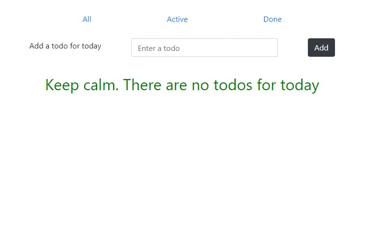

### ✅ Create a simple  **TODO**-list

#### [Getting Started with Redux](https://egghead.io/courses/getting-started-with-redux)

   ##### Your application should do the following: 
   * add `todo` using component `Form`;
   * display a list of your `todo`;
   * every `todo` should have buttons `delete` and `done` (button `done` should work the same way as undoing an action);  
   * it must be possible to display `all`, `done` and `active` todos;

   ##### Optional:
   * use [`styled-components`](https://www.styled-components.com/) for styles;
   * use `localstorage` to save application state;
   * use [`react-router-dom`](https://reacttraining.com/react-router/web/guides/philosophy) for routing (for example pages `all`, `done`, `active`, `not found`);

### How the application might look like:

